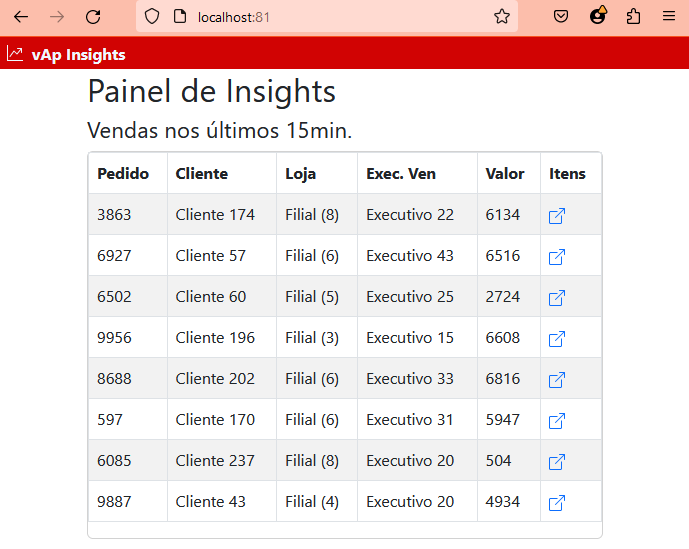

# **FASTAPI - API de Vendas:**

Repositório com o conceito de demonstrar como disponibilizar dados através de API Rest utilizando a biblioteca FASTAPI.

Siga o roteiro:
- python -m venv venv
- ./venv/Script/Activate
- pip install -r requirements.txt

Após sua console estar em ambiente virtual (venv), siga os passos abaixo:
- Para subir a API de entrega de ITENS DO PEDIDO, execute o comando:
    + uvicorn.exe endpoint03_coletaItens:app --port=83 --host=0.0.0.0 --reload
    + para testar, basta acessar a URL http://localhost:83/pedido/items/1
- Abra outro console para subir uma API que gera uma lista de pedidos aleatória
    + uvicorn.exe endpoint02_coletaPedidos:app --port=82 --host=0.0.0.0 --reload
    + para testar, basta acessar a URL http://localhost:82/api/pedidos
- E por fim, para subir a aplicação web, abra outro console e execute o comando abaixo
    + uvicorn.exe endpoint01_server:app --port=81 --host=0.0.0.0 --reload
    + para testar, basta acessar a URL http://localhost:81 

